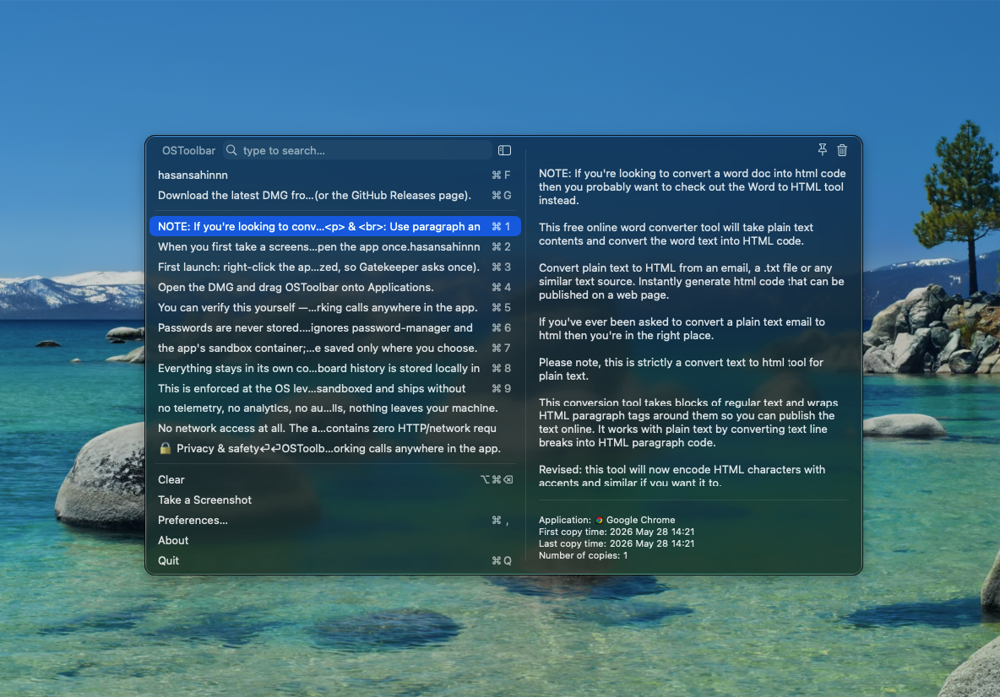
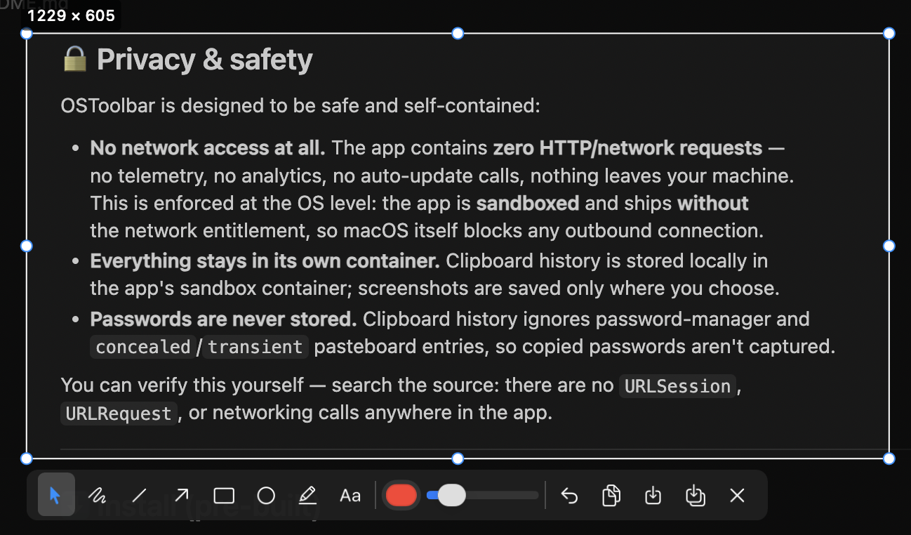
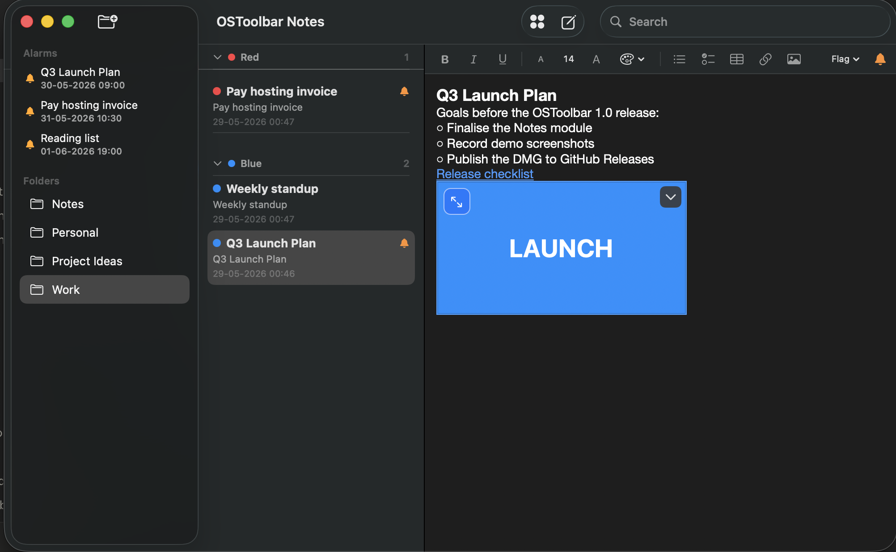

# OSToolbar

[](https://github.com/hasansahinnn/os-toolbar/releases/latest)
[](https://github.com/hasansahinnn/os-toolbar/releases)
[](LICENSE)


A lightweight macOS **menu-bar toolkit** that bundles three everyday tools in one
app — each with its own menu-bar icon:

- **📋 Clipboard history** — automatically keeps your recent copies (last 100), so
you can search and paste anything you copied earlier.
- **📸 Screenshot** — a region capture with a built-in annotation
editor (pen, line, arrow, rectangle, ellipse, highlighter, text), color and size
controls, then copy, save, or save-as — plus a one-key full-screen grab.
- **📝 Notes** — a Notes-style editor with real folders on disk, rich text
(checklists, tables, links, images), color flags with grouping, search, and
**reminders/alarms** that pop up at a time you set.

It lives quietly in the menu bar — no Dock icon, no window clutter.

> Requires **macOS Sonoma 14 or later**, Apple Silicon.

## Screenshots

**Clipboard history**



**Screenshot capture & annotation**



**Notes with folders, color groups & alarms**



---

## 🔒 Privacy & safety

OSToolbar is designed to be safe and self-contained:

- **No network access at all.** The app contains **zero HTTP/network requests** —
no telemetry, no analytics, no auto-update calls, nothing leaves your machine.
This is enforced at the OS level: the app is **sandboxed** and ships **without**
the network entitlement, so macOS itself blocks any outbound connection.
- **Everything stays on your Mac, as plain files.** Clipboard history lives in the
app's sandbox container; screenshots are saved where you choose; notes are stored as
ordinary files/folders in `~/Documents/OSToolbarNotes` (rich text + a small JSON of
metadata) — no database, so you can read, back up, or sync them yourself.
- **Passwords are never stored.** Clipboard history ignores password-manager and
`concealed`/`transient` pasteboard entries, so copied passwords aren't captured.
- **Reminders are local.** Note alarms are fired by the app itself while it runs —
no push service, no account, nothing leaves the machine.

You can verify this yourself — search the source: there are no `URLSession`,
`URLRequest`, or networking calls anywhere in the app.

---

## ✅ Verify it's safe (free public tools)

Don't take our word for it — verify it yourself with free tools:

### Scan with VirusTotal (free, 70+ antivirus engines)
This release has already been scanned — see the public report:

**▶ [VirusTotal report for OSToolbar-v1.0.0.dmg](https://www.virustotal.com/gui/file/349bd87ea9bf9bcb8fdbc9ac7ac5d05f4d545ed8ce7dab71dcdc5749fb87c095)**

You can also re-upload it yourself at [virustotal.com](https://www.virustotal.com/gui/home/upload).

> **About the 1/61 "Wacatac.B!ml" result:** only Microsoft Defender's *machine-learning*
> engine flags it (note the `!ml` suffix = heuristic guess, not a known-malware signature).
> Every signature-based engine — and even Microsoft's own non-ML scanner — reports
> **Undetected**. `Wacatac.B!ml` is one of Defender's most common **false positives** for
> brand-new, self-signed (non-notarized) apps with no download reputation yet — and an app
> that *reads the clipboard and captures the screen* trips ML heuristics by design, even
> though it sends nothing anywhere. The full source is in this repo; build it yourself to
> confirm. (Such ML false positives can be reported to
> [Microsoft's submission portal](https://www.microsoft.com/en-us/wdsi/filesubmission) to be cleared.)

---

## ⬇️ Install (pre-built)

1. Download the latest DMG (or ZIP) from the [**Releases page**](https://github.com/hasansahinnn/os-toolbar/releases/latest).
2. Open the DMG and drag **OSToolbar** onto **Applications**.
3. First launch: **right-click the app → Open** (the build is signed with a
  self-signed certificate, not Apple-notarized, so Gatekeeper asks once).
4. When you first take a screenshot, macOS asks for **Screen Recording**
  permission — grant it (System Settings → Privacy & Security → Screen Recording),
   then **quit and reopen** the app once.

---

## 🚀 Usage

OSToolbar adds **three separate menu-bar icons** — one each for Clipboard,
Screenshot, and Notes — so every tool is one click away.

### ⌨️ Default shortcuts

| Action | Shortcut |
| --- | --- |
| Open clipboard history | **⌘⇧C** |
| Region screenshot (annotate) | **⌘⇧S** |
| Quick full-screen screenshot | **⌘⇧A** |
| Open screenshot folder | **⌘⇧F** |
| Open Notes | **⌘⇧N** |

All shortcuts are configurable in each tool's **Preferences**.

### 📋 Clipboard history

- Click the clipboard icon to open the history (last 100 copies).
- Type to search; press **Return** to paste the selected item.
- Pins and the footer scroll together with the list; fast scrolling stays smooth.
- Configure the open shortcut in **Settings → General**.

### 📸 Screenshot

- Click the camera icon for a menu: **Screenshot**, **Quick Screenshot**,
  **Open Image Folder**, **Preferences**.
- **⌘⇧S** starts a region capture; drag to select. A toolbar appears with:
  - **Tools:** pen, line, arrow, rectangle, ellipse, highlighter, text
  - **Color** and **size** controls, **Undo (⌘Z)**
  - **Copy (⌘C)** — copy to the clipboard (also lands in clipboard history)
  - **Save** — write straight to the default folder
  - **Save As…** — choose where to save
  - **Esc** — cancel
- **⌘⇧A** instantly captures the whole screen and saves it (with a preview thumbnail).
- Screenshots are saved to `~/Pictures/OSToolBar ScreenShot` by default; change the
  folder, shortcuts, and default color/sizes in **Screenshot → Preferences**.

### 📝 Notes

- Click the notes icon (or press **⌘⇧N**) to open the Notes window.
- **Folders (left):** real directories on disk — create, rename, delete, and
  *Show in Finder* from the right-click menu.
- **Notes list (middle):** title, preview, and date. Assign a **color flag**
  (right-click → Color); notes group into **collapsible color sections**. Search
  across titles and content from the toolbar.
- **Editor (right):** rich text with **bold/italic/underline**, font size, text
  color, **bullet & checklist** (press Return to continue the list, click a circle
  to tick it), **tables**, **links**, and **images** (hover an image for a preview
  button; it's capped in size so it never floods the page).
- **Alarms ⏰:** open the bell menu in the editor to add a reminder for any note —
  pick a date and time, optionally a label. When it's due, a panel slides in at the
  top-right; click **Open** to jump to the note. Notes with a pending alarm show a
  bell in the list, and all upcoming alarms appear under **Alarms** in the sidebar.
- Notes are saved as plain files in `~/Documents/OSToolbarNotes` (rich text +
  metadata) — no database. Change the folder or the shortcut in **Notes → Preferences**.

---

## 🛠 Build from source

```sh
git clone https://github.com/hasansahinnn/os-toolbar.git
cd os-toolbar
open OSToolbar.xcodeproj   # build & run in Xcode (scheme: OSToolbar)
```

Or produce a signed, distributable DMG from the command line:

```sh
tools/build-dmg.sh
```

This builds the Release app, signs it with a local self-signed certificate, and
writes `dist/OSToolbar.dmg`. (The script expects a code-signing identity named
`OSToolbar Code Signing` in your login keychain; for a quick local run you can also
just build the `OSToolbar` scheme in Xcode.)

**Dependencies** (resolved automatically via Swift Package Manager):
Defaults, KeyboardShortcuts, Sauce, Settings, SwiftHEXColors, swift-log,
LaunchAtLogin, fuse-swift.

---

## 🙏 Credits

The clipboard-history engine is derived from the excellent open-source
**[Maccy](https://github.com/p0deje/Maccy)** by Alexey Rodionov, used under the MIT
License. The screenshot module and the menu-bar toolkit packaging are original to
this project. See [LICENSE](LICENSE) for full attribution.

## 📄 License

[MIT](LICENSE).